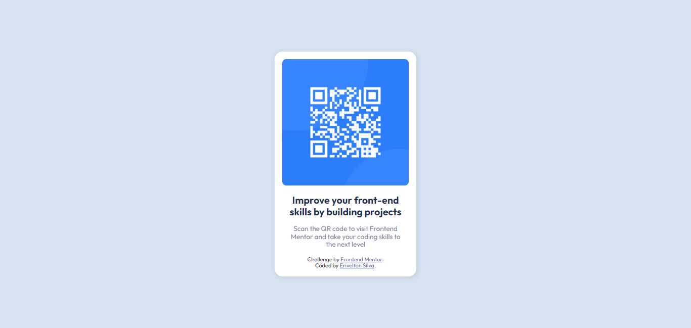

# Frontend Mentor - QR code component solution

This is a solution to the [QR code component challenge on Frontend Mentor](https://www.frontendmentor.io/challenges/qr-code-component-iux_sIO_H). Frontend Mentor challenges help you improve your coding skills by building realistic projects.

## Table of contents

-   [Overview](#overview)
    -   [Screenshot](#screenshot)
    -   [Links](#links)
-   [My process](#my-process)
    -   [Built with](#built-with)
-   [Author](#author)

## Overview

### Screenshot

### Links

-   Solution URL: [https://www.frontendmentor.io/solutions/qr-code-component-vzWX5HuQu_](https://www.frontendmentor.io/solutions/qr-code-component-vzWX5HuQu_)
-   Live Site URL: [https://qr-code-component-omega-gilt.vercel.app/](https://qr-code-component-omega-gilt.vercel.app/)

## My process

### Built with

-   Semantic HTML5 markup
-   CSS custom properties
-   Flexbox
-   CSS Grid
-   BEM
-   SASS

## Author

<!-- - Website - [Add your name here](https://www.your-site.com) -->

-   Frontend Mentor - [@eriveltondasilva](https://www.frontendmentor.io/profile/eriveltondasilva)
-   Instagram - [@erivelton.dsilva](https://www.instagram.com/erivelton.dsilva/)
-   Twitter - [@EriveltonDSilva](https://twitter.com/EriveltonDSilva)
